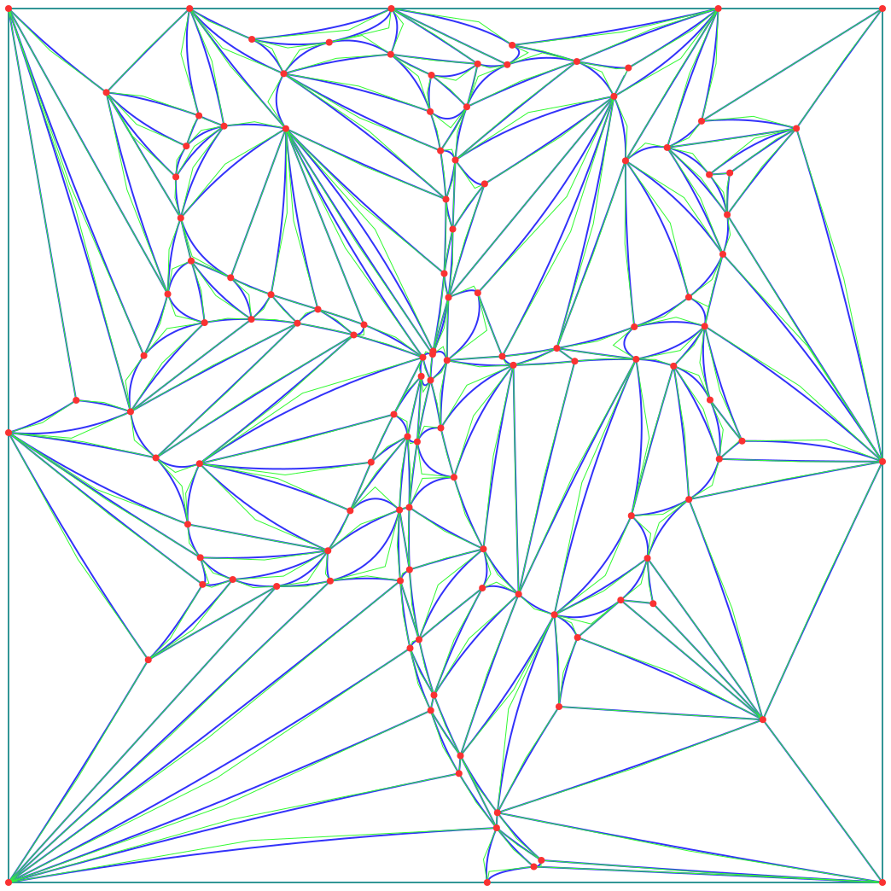

# image-curved-triangulation

This program is the implementation of the paper '[Xiao, Yanyang, Cao, Juan, and Chen, Zhonggui. Image Representation on Curved Optimal Triangulation. Computer Graphics Forum, 2022, 41(6), 23-36](https://doi.org/10.1111/cgf.14495)'

Part of the implementation has been optimized, which is slightly different from what is described in the paper.

## dependencies
stb: https://github.com/nothings/stb.git
Eigen: https://eigen.tuxfamily.org/index.php
triangle: https://www.cs.cmu.edu/~quake/triangle.html
OpenMesh: http://www.openmesh.org/

## compile
Using CMake

## example
   

## cite

If you find our code or paper useful, please consider citing

```
@article{Xiao2022-CurvedTriangulation,
author = {Xiao, Yanyang and Cao, Juan and Chen, Zhonggui},
title = {Image Representation on Curved Optimal Triangulation},
journal = {Computer Graphics Forum},
volume = {41},
number = {6},
pages = {23-36},
year = {2022}
}
```
